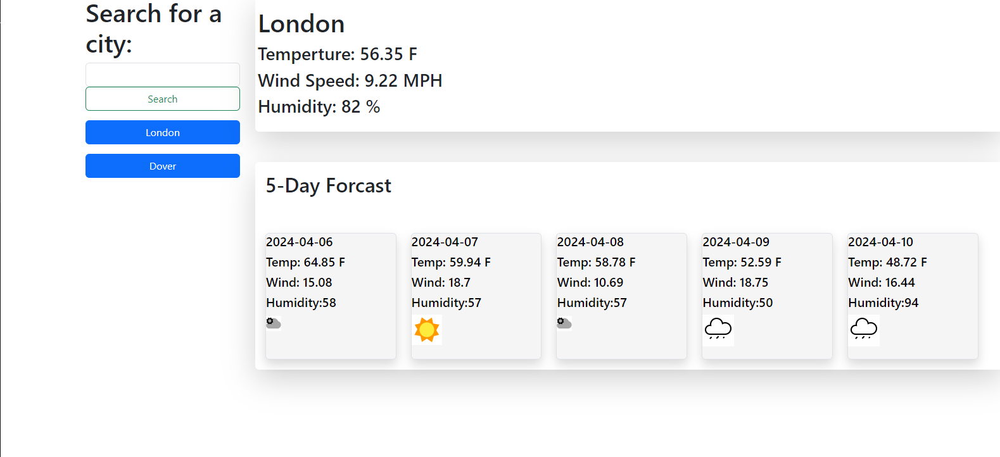

# Weather_Dashboard_API

Author: Kendell Rennie

This is a weather App. Tt will show the weather and the 5 day forcast of any city in the world by getting data from the OpenWeather API.

To use the webapp just type in the search box the city and it will show the Weather and forcast.  
Your searches will be saved as buttons on the left hand side, in case you want to see the location again.
